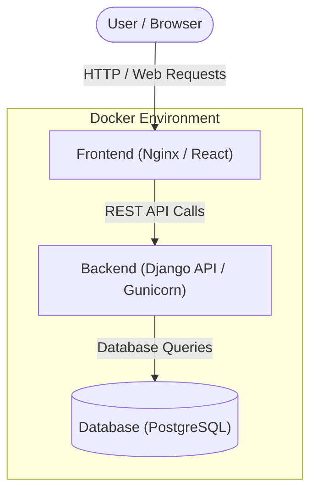

# Product Requirements Document (PRD): OrderNest

## 1. Product Overview
**OrderNest** is a full-stack, minimalist food delivery web application. It is designed to provide a seamless, lightning-fast experience for users to browse restaurants, manage their carts, and place food orders. The application features a robust backend for managing restaurants, menus, users, and orders, along with a sleek, SaaS-inspired frontend with out-of-the-box dark mode support.

## 2. System Architecture (Dockerized)
The application is structured as a multi-container Docker environment:
- **`db`**: PostgreSQL database container storing all application data.
- **`backend`**: Django API container, handling business logic, authentication, and database connections. Depends on the database container.
- **`frontend`**: Nginx container serving the built React static files, acting as the user-facing web server. Depends on the backend container.

### Architecture Diagram

## 3. Target Audience
- **End Users**: Individuals looking to order food online efficiently with a modern, fast, and easy-to-use interface.
- **Platform Administrators**: Managers who need an admin dashboard to oversee restaurants, manage menus, track orders, and administer user accounts.

## 4. Technology Stack
### Backend
- **Framework**: Django
- **API Architecture**: Django REST Framework (DRF)
- **Authentication**: SimpleJWT (JSON Web Tokens)
- **Database**: PostgreSQL (via Docker) / SQLite3 (local development)
- **Server**: Gunicorn
- **Deployment & Containerization**: Docker, Docker Compose

### Frontend
- **Framework**: React.js (v19)
- **Build Tool**: Vite
- **Styling**: Tailwind CSS v4
- **Icons**: Lucide React
- **State Management**: Context API
- **Routing**: React Router DOM
- **HTTP Client**: Axios
- **Server**: Nginx (in production Docker container)

## 5. Core Features

### 5.1. User Management & Authentication
- **User Registration & Login**: Secure JWT-based authentication system.
- **Role Management**: Differentiate between regular users and administrative users.
- **Session Management**: Persistent sessions using securely stored JWTs.

### 5.2. Restaurant & Menu Management
- **Restaurant Listing**: Users can browse a dynamic list of available restaurants.
- **Menu Exploration**: Users can view detailed menus for individual restaurants, including item descriptions and prices.
- **Admin Controls**: Administrators can add, update, and remove restaurants and their corresponding menu items through the Django Admin panel.

### 5.3. Cart Management
- **Add/Remove Items**: Users can easily add items to their cart and remove them.
- **Quantity Adjustments**: Users can increment or decrement the quantity of selected items.
- **Conflict Resolution (Single-Restaurant Policy)**: The cart enforces a rule where it can only contain items from a single restaurant at a time. Attempts to add items from a different restaurant will prompt a conflict warning or reset the cart.

### 5.4. Order Management
- **Checkout Process**: Users can place an order from their current cart.
- **Order Tracking**: Users can view the status of their active orders.
- **Order History**: Users have access to their past orders.
- **Admin Oversight**: Administrators can view and update the status of all system orders.

### 5.5. Admin Dashboard
- A fully configured Django Admin panel to manage all core models: Users, Restaurants, Menus, and Orders.

## 6. UI/UX & Non-Functional Requirements
- **Aesthetic Design**: Deviates from traditional heavy orange/red food apps, favoring a slate & emerald utility-driven palette.
- **Dark Mode**: Out-of-the-box support for a sleek, modern dark theme.
- **Micro-Animations**: Standard micro-animations, modern shadows, and rounded components for a premium SaaS-inspired feel.
- **Responsive Design**: Designed to work seamlessly across desktop and mobile browsers.
- **Performance**: Optimized frontend via Vite and lightweight React setup.
- **Security**: Password hashing, secure token exchange, and protected API endpoints.

## 7. Future Enhancements (Suggested)
- Payment gateway integration (e.g., Stripe, PayPal).
- Real-time order tracking with WebSockets.
- Delivery personnel (driver) app/interface.
- User reviews and ratings for restaurants and items.
- Promotional codes and discount system.
